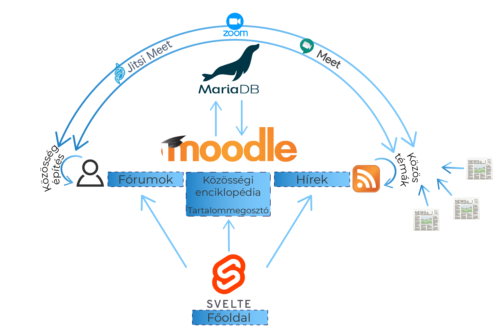

# Technikai összefoglaló

A teljes dokumentációnk [ezen](https://csapat08-versenydonto.nisz.hu/mod/wiki/view.php?id=6) az oldalon olvasható el. Ennek a dokumentumnak a végén pedig teszt felhasználók adatai vannak, amivel kipróbálható a rendszer.  
(Ismert hiba: A CMS néha valamiért összekeveri az oldalon található képeket. Elegendő F5 nyomogatás után, helyre szokott jönni.)

*Vezess, vezess új létre, Lucifer!  
Csatára szálltam szent eszmék után*

## Bevezetés
A feladat értelmezése után elkezdtük felmérni, hogy milyen létező megoldások vannak a piacon, milyen keretrendszerek segíthetnek nekünk, és hogy milyen megvalósítási utat válasszunk.

Ennek eredménye az lett, hogy amellett döntöttünk, hogy egy már meglévő nyílt forráskodú rendszert bővítünk ki saját megoldással, mivel így érhetjük el azt, hogy a lehető legkevesebb idő alatt, a lehető legtágabb funkció palettát nyújtsuk, és legközelebb legyen a felhasználói élmény a kívánatoshoz.

Célkitűzésünk egy rugalmasan bővíthető, sok integrációt támogató rendszer megalkotása volt, és ehhez a Moodle rendszert választottuk, ami hosszú ideje ismert az oktatás terén a páratlan alkalmassága és nyílt természete végett.

Rendszerünk elsődleges célja így a közösség alkotás lett, és másodlagosan egy tudásmegosztó felület, harmadlagosan egy munkatér egy céges környezeten belül.

## Koncepciós terv
Elképzelésünk az volt, hogy ezt elérhessük, hogy az iskolára tervezett Moodle rendszerét átalakítsuk egy élettel telibb, interaktívabb és nyitottabb rendszerré a felhasználókkal szemben. Ezért a rendszer jellemzően nyílt (vagy céges esetben engedéllyel nyílt) kurzusokat tartalmaz, amikben a felhasználók akár bejelentkezés nélkül is megtalálhatják amit keresnek (akár a keresőmotorral, akár maguktól), de jellemzően hozzá is szólhatnak, ha szereznek egy tagsági fiókot.

Ahhoz hogy közösséget építsünk két fontos dologra van szükség. Az egyik ilyen a közös téma, a másik ilyen a megfelelő kommunikációs lehetőség. Az előbbit úgy értük el, hogy a nyílt sztenderdű RSSen keresztül betöltjük egyes hírújságok tartalmát, és ezek tartalmát egy helyen mutatjuk a felhasználóknak. Az utóbbit úgy oldjuk meg, hogy közismert fórumos megoldáson túl mindenhol rögtön személyesebb Jitsi alapú kommunikációs csatornát is nyújtunk, és így a felhasználó anélkül hogy el kell hagyja a rendszert el is olvashatta a kedvenc újságától az új cikkeket, arról írhatott egy fórumbejegyzést, és még meg is vitathatta a barátaival egy videóhívásban. 

Ezen túl tervünk része volt az is, hogy a cég alkalmazottai kapjanak egy felületet, amin tudnak egymással projektekkel kapcsolatban biztonságosan és hatékonyan egymással kommunikálni, ezen túl információkat és adatokat megosztani. Ehhez a Moodle beépített kurzus rendszerei bőven túlcsorduló választékot kínál, és így a lehető legkreatívabb és hatékonyabb módon lehet együtt működni.

## Felépítés
A felhasználói élményt úgy terveztük meg, hogy az első dolog amit a felhasználó lát, egy segítőkész felület, ami minden kérdését képes megválaszolni, és ez szolgálhasson egy "központi összekötőnek" ahonnan a tartalmak elérhetőek. 

Innen egy kapu szerűen érhetőek el a szoftver kiemelt funkciói:

- Fórum hálózat különböző témákhoz, amiket adminisztrátorok könnyen bővíthetnek
- Hírportálhoz, ahol rögtön lehetőségük van közösségként részt is venni a történések megvitatásában
- A tudásbázishoz, ami részletes leírást tartalmaz a rendszerhez, és ezen túl további hasznos tudásokat.

Regisztrált felhasználók esetén:
- Személyen blog felület, ami elérhető az internet felől
- Egy privát beszélgető szoba a Jitsi segítségével

Alkalmazottak számára:
- Munkatér, amit csak a többi alkalmazott lát.

Felhasználói útmutatás:
A rendszer egy belsőleg szerkesztett felhasználó útmutatóval van ellátva, ami a [következő címen](https://csapat08-versenydonto.nisz.hu/mod/wiki/view.php?id=6) érhető el, vagy a főoldalon rögtön az információs gomb lenyomásával.

Teszteléshez felhasználó adatok:  
- Felhasználónév: 
    - Vendég: -
    - Felhasználó: nisz-user
    - Moderátor: nisz-moderator
    - Szerkesztő: nisz-szerkeszto
    - Adminisztrátor: nisz-admin
- Jelszó (azonos): GDEHm-qp$Fj=7W&7
